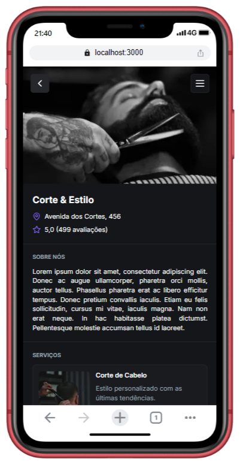

# Barber NextJS

Essa aplicação foi desenvolvida durante o evento Full Stack Week do dicasparadev.
É uma aplicação FullStack construída com Next serve para o usuário fazer agendamento nas barbearias disponíveis.

## Executando

Após clonar o repositório, acesse a pasta do projeto e execute os comandos abaixo:

Ter o docker instalado na máquina.

```sh
npm install

docker compose up

npx prisma migrate dev
prisma db seed

npm run dev

```

Acesse <http://localhost:3000> para visualizar a aplicação.

## Screenshots

<p>
  
  
  
</p>
